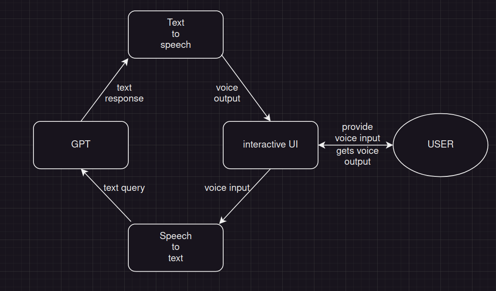

# german_app

The main goal of this project is to create an environment to help learn German. In the future it may be expanded to include other languages to.
In my opinion, someone can achieve much more by speaking than by learning vocabulary by heart, but why pay a tutor to do it? 

This is mainly what my idea is about:
- features that provide interactivity and allow the user to talk freely with the software in German,
- functions that allow the user to learn and repeat random words (consider an algorithm that selects words to repeat),
- functions that allow the user to learn grammar from examples generated by the GPT model.

1. Data flow

2. Requirements (R_<module_abbreviation>_ID)

R_UI_0 - UI should make it possible to start recording and end recording\
R_UI_1 - while recording, UI should capture voice over recording device and buffer it\
R_UI_2 - if recording is taking more than 30 seconds the capture should be stopped immediately by the system\
R_NLP_0 - software should use a library to both translate text into speech and speech into text\
R_NLP_1 - sofware should await for text input and feed user interface witch buffered voice output\
R_NLP_2 - software should await for buffered voice input and feed text into GPT\
R_GPT_0 - after feeding GPT model, software should await for response\
R_GPT_1 - after geting a response from GPT model, software should pass the text to text-to-speech model\
